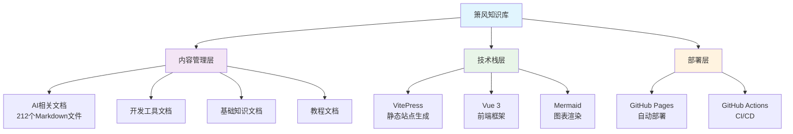

# CLAUDE.md - 箫风知识库 AI 上下文

> **初始化时间**: 2026-01-20T19:31:29+08:00
> **项目架构师**: Claude Code Assistant
> **上下文策略**: 根级简明 + 模块级详尽

## 📋 项目概述

**箫风的个人技术知识库** - 一个基于 VitePress 的技术文档站点，致力于记录和分享碎片化、结构化、体系化的技术知识内容。

### 🎯 项目使命
- 构建个人技术知识体系
- 分享实用技术经验
- 提供高质量技术参考

### 🛠 技术栈
- **前端框架**: Vue 3.5.13 + VitePress 1.6.3
- **构建工具**: Vite 5.0.3 + pnpm
- **图表渲染**: Mermaid 9.3.0 + AntV G2Plot
- **搜索服务**: Algolia DocSearch
- **评论系统**: Gitalk

## 🏗️ 架构总览



## 📂 模块索引

### 🎯 核心模块

| 模块路径 | 描述 | 文档数量 | 状态 |
|---------|------|---------|------|
| `docs/ai/` | AI相关技术文档 | ~40 | ✅ 活跃 |
| `docs/dev-tools/` | 开发工具合集 | ~60 | ✅ 活跃 |
| `docs/tutorials/` | 技术教程 | ~35 | ✅ 活跃 |
| `docs/basics/` | 基础知识 | ~25 | ✅ 活跃 |
| `docs/computer/` | 计算机技术 | ~20 | ✅ 活跃 |
| `docs/browser/` | 浏览器技术 | ~15 | ✅ 活跃 |

### 🔧 工具模块

| 模块路径 | 描述 | 文档数量 | 状态 |
|---------|------|---------|------|
| `docs/online-tools/` | 在线工具 | ~12 | ✅ 活跃 |
| `docs/tools/` | 通用工具 | ~12 | ✅ 活跃 |

### 📚 导航模块

| 模块路径 | 描述 | 状态 |
|---------|------|------|
| `docs/index.md` | 站点首页 | ✅ 活跃 |
| `docs/tags.md` | 标签页 | ✅ 活跃 |
| `docs/archives.md` | 归档页 | ✅ 活跃 |

## 🔧 全局规范

### 📝 文档规范
- **语言**: 中文（简体）
- **格式**: Markdown + Frontmatter
- **图片**: 存储在 `docs/public/` 目录
- **链接**: 相对路径，基于 `/xf-blog/` 部署路径

### 🎨 样式规范
- **主题**: 自定义 VitePress 主题
- **组件**: Arco Design Vue 组件库
- **图表**: Mermaid + AntV G2Plot
- **图标**: 支持自定义元素标签

### 🚀 部署规范
- **平台**: GitHub Pages
- **分支**: `main` → `pages`
- **路径**: `/xf-blog/`
- **CI/CD**: GitHub Actions 自动部署

## 📊 项目统计

- **总文档数**: 212 个 Markdown 文件
- **主要分类**: 8 个大类
- **更新频率**: 持续更新
- **访问地址**: https://rockyflux.github.io/xf-blog/

## 🔗 导航面包屑

```
🏠 箫风知识库
├── 🎯 核心模块
│   ├── 🤖 AI相关 → docs/ai/
│   ├── 🛠️ 开发工具 → docs/dev-tools/
│   ├── 📚 教程 → docs/tutorials/
│   ├── 🔰 基础知识 → docs/basics/
│   ├── 💻 计算机技术 → docs/computer/
│   └── 🌐 浏览器技术 → docs/browser/
├── 🔧 工具模块
│   ├── 🛠️ 在线工具 → docs/online-tools/
│   └── 🔧 通用工具 → docs/tools/
└── 📚 导航页面
    ├── 🏠 首页 → docs/index.md
    ├── 🏷️ 标签页 → docs/tags.md
    └── 📅 归档页 → docs/archives.md
```

## 🎯 开发指南

### 本地开发
```bash
# 安装依赖
pnpm install

# 启动开发服务器
pnpm dev

# 构建生产版本
pnpm build

# 索引到 Algolia
pnpm index:algolia
```

### 文档编写
- 新文章放在对应分类目录下
- 使用 Frontmatter 配置元数据
- 支持 Mermaid 图表语法
- 支持数学公式和脚注

---

*此文档由 Claude Code Assistant 于 2026-01-20 自动生成。如需更新，请运行 `/ccg/init` 命令。*