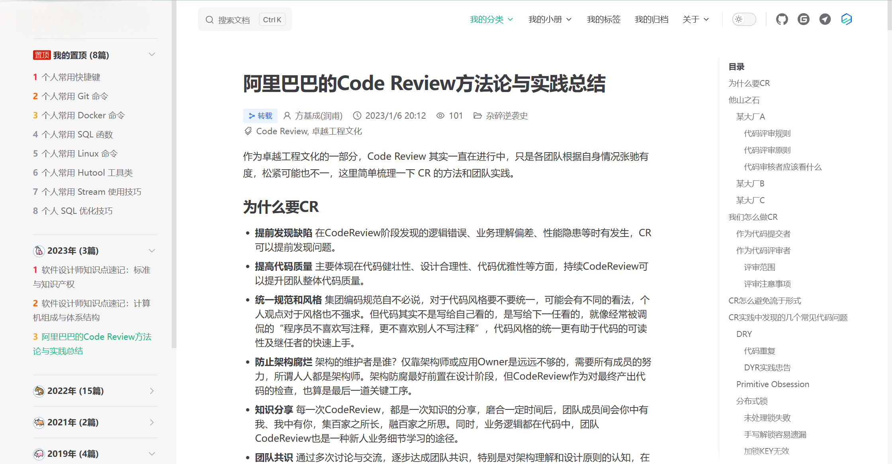
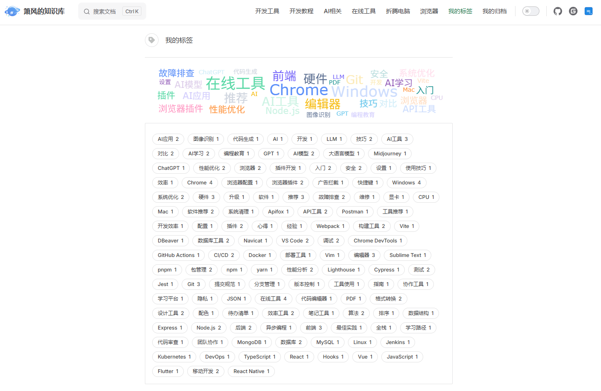
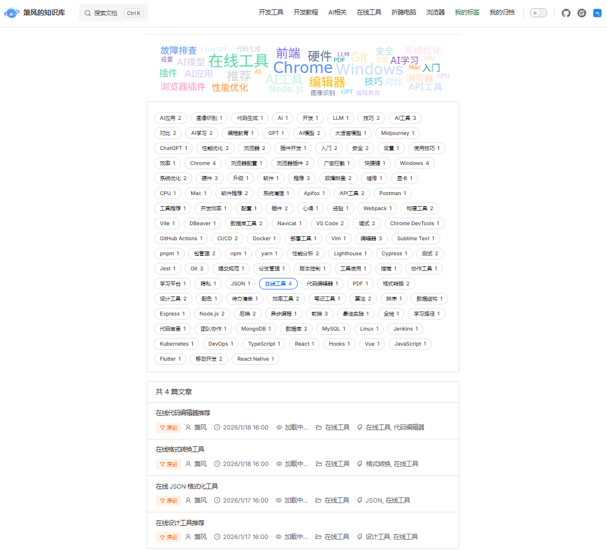
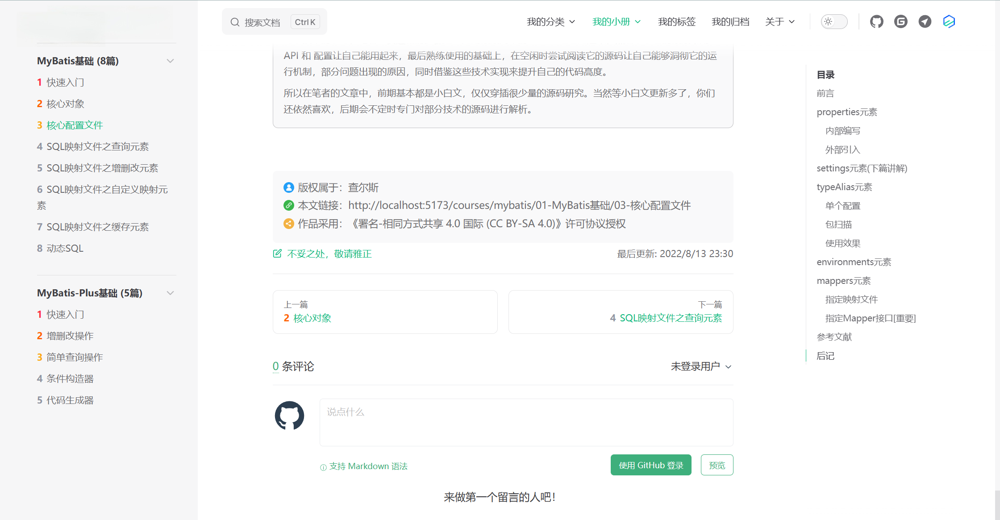

# 箫风的知识库

<a href="http://creativecommons.org/licenses/by-sa/4.0/" target="_blank">
    
</a>
<a href="./LICENSE" target="_blank">
    
</a>
<a href="https://github.com/rockyflux/xf-blog/actions/workflows/deploy-pages.yml" target="_blank">
    
</a>


📝 **箫风的个人技术知识库，记录 & 分享个人碎片化、结构化、体系化的技术知识内容。** 

🌐 [在线访问](https://rockyflux.github.io/xf-blog)

## 快速开始

```bash
# 1. 克隆仓库
git clone https://github.com/rockyflux/xf-blog.git

# 2. 安装 PNPM
npm install pnpm -g

# 3. 设置淘宝镜像源（可选，提升下载速度）
pnpm config set registry https://registry.npmmirror.com/

# 4. 安装依赖
pnpm install

# 5. 启动开发服务器，访问 http://localhost:5173
pnpm dev

# 6. 构建生产版本，输出目录：docs/.vitepress/dist
pnpm build
```

## 部署

本项目使用 GitHub Actions 自动部署。当代码推送到 `main` 分支时，会自动构建并部署到 GitHub Pages。

### 首次部署

1. **配置 GitHub Pages**
   - 访问仓库设置：`https://github.com/rockyflux/xf-blog/settings/pages`
   - **Source** 选择：`Deploy from a branch`
   - **Branch** 选择：`pages`，路径选择 `/ (root)`
   - 点击 **Save** 保存

2. **推送代码触发部署**
   ```bash
   git push origin main
   ```
   推送后，GitHub Actions 会自动构建并推送到 `pages` 分支。

3. **查看部署状态**
   - 在仓库的 **Actions** 标签页查看部署进度
   - 部署完成后，站点会在几分钟内生效
   - 访问地址：`https://rockyflux.github.io/xf-blog/`

### 注意事项

- 部署完成后可能需要几分钟时间才能访问
- 如果仓库名不是 `username.github.io`，需要在 `docs/.vitepress/config.ts` 中配置 `base` 路径（本项目已配置为 `/xf-blog/`）
- 部署失败时，请查看工作流日志排查问题

## 功能特性

- [x] **配置管理**：拆分配置文件，提取公共配置，便于维护

- [x] **自动部署**：GitHub Actions 自动构建并部署到 GitHub Pages（详见 [部署说明](#部署)）

- [x] **自动侧边栏**：按目录结构自动生成侧边栏，支持文章置顶🔝（在文章 frontmatter 中配置 `isTop: true`）

- [x] **主页美化**：参照 Vite 文档风格进行美化

- [x] **自定义页脚**：支持 ICP 备案号、公安备案号、版权信息配置

- [x] **文章元数据**：显示原创标识、作者、发布时间、分类、标签等信息，可全局配置作者信息
  - [x] 支持文章阅读数统计（需自行配置 API 服务，可在 `docs/.vitepress/config/theme.ts` 中关闭）

- [x] **标签系统**：模仿语雀标签页风格，支持标签云展示

- [x] **文章归档**：自定义时间轴展示历史文章，支持按分类、标签筛选，年份前可显示生肖

- [x] **文章评论**：集成 Gitalk 评论系统

- [x] **版权声明**：文末自动显示原创或转载文章的版权声明，可自定义版权协议

- [x] **Mermaid 流程图**：支持在 Markdown 中绘制流程图、状态图、时序图、甘特图、饼图等（[Mermaid 官方文档](https://github.com/mermaid-js/mermaid/blob/develop/README.zh-CN.md)）

- [x] **Markdown 扩展**：支持脚注、数学公式

- [x] **细节优化**
  - [x] 文章内图片圆角样式
  - [x] 浏览器滚动条样式优化（支持 Firefox、Chrome 等）
  - [x] 侧边栏文章列表序号显示


## 部分页面截图

### 主页美化


### 侧边栏置顶分组（自动生成侧边栏及置顶分组）


### 文章元数据信息



### 我的标签




### 我的归档


### 文章评论


### 版权声明



### Mermaid 流程图


## 特别鸣谢

- [vuejs/vitepress](https://github.com/vuejs/vitepress) （本知识库基于 VitePress 构建）
- [vitejs/vite](https://github.com/vitejs/vite) （参考主页美化）
- [windicss/docs](https://github.com/windicss/docs) （参考配置文件拆分）
- [brc-dd/vitepress-blog-demo](https://github.com/brc-dd/vitepress-blog-demo) （感谢 VitePress 维护者 brc-dd 的热心帮助）
- [brc-dd/vitepress-with-arco](https://github.com/brc-dd/vitepress-with-arco) 
- [clark-cui/vitepress-blog-zaun](https://github.com/clark-cui/vitepress-blog-zaun) （参考文章标签的数据处理方案）
- [dingqianwen/my-blog](https://github.com/dingqianwen/my-blog) （参考 Gitalk 配置暗黑主题）
- [Dedicatus546/Dedicatus546.github.io](https://github.com/Dedicatus546/Dedicatus546.github.io) （参考 Gitalk 跨域调用 API 失效的解决方案）
- [xiaoxian521/pure-admin-utils-docs](https://github.com/xiaoxian521/pure-admin-utils-docs) （参考词云组件的使用）
- [arco-design/arco-design-vue](https://github.com/arco-design/arco-design-vue) （使用部分组件及图标）
- [antvis/G2plot](https://github.com/antvis/G2plot) （使用部分图表）
- [emersonbottero/vitepress-plugin-mermaid](https://github.com/emersonbottero/vitepress-plugin-mermaid) （VitePress Mermaid 流程图插件）
- [mermaid-js/mermaid](https://github.com/mermaid-js/mermaid/blob/develop/README.zh-CN.md)
- ......

## 许可证

- 文章遵循 [CC 4.0 BY-SA](http://creativecommons.org/licenses/by-sa/4.0/) 协议，转载请附上原文出处链接和声明
- 源码遵循 [MIT](./LICENSE) 协议
- Copyright © 2026 箫风
