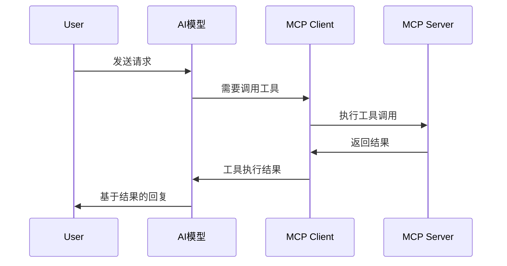

# MCP协议使用指南：让AI模型安全访问外部工具

<!-- more -->

## 概述

MCP（Model Context Protocol）是由Anthropic推出的开源协议，旨在标准化AI模型与外部工具和数据源的交互方式。通过MCP，AI助手可以安全、可靠地访问文件系统、数据库、API等外部资源，而无需复杂的自定义集成。

本文将详细介绍MCP的核心概念、工作原理、实际使用方法，并通过具体案例展示如何在不同的开发环境中集成和使用MCP。

## MCP 核心架构

### 协议组成

MCP 采用客户端-服务器架构，主要由以下组件构成：

- **MCP Client**：集成到AI应用中的客户端，负责与AI模型通信
- **MCP Server**：提供具体工具功能的服务器，可以是本地进程或远程服务
- **Transport Layer**：基于JSON-RPC 2.0的通信协议
- **Tool Schema**：标准化工具描述格式

### 工作流程



## 核心概念详解

### 工具（Tools）

工具是MCP的核心概念，每个工具代表一个可执行的功能：

```json
{
  "name": "read_file",
  "description": "读取指定文件的内容",
  "inputSchema": {
    "type": "object",
    "properties": {
      "path": {
        "type": "string",
        "description": "文件路径"
      },
      "encoding": {
        "type": "string",
        "enum": ["utf8", "ascii"],
        "default": "utf8"
      }
    },
    "required": ["path"]
  }
}
```

### 资源（Resources）

资源代表AI可以访问的数据源：

```json
{
  "uri": "file:///home/user/document.txt",
  "name": "用户文档",
  "description": "用户的重要文档文件",
  "mimeType": "text/plain"
}
```

### 提示词（Prompts）

预定义的提示词模板，帮助AI更好地完成特定任务。

## 快速开始

### 环境准备

#### 1. 安装 MCP SDK

**Python:**
```bash
pip install mcp
```

**Node.js:**
```bash
npm install @modelcontextprotocol/sdk
```

**Go:**
```bash
go get github.com/modelcontextprotocol/go-sdk
```

#### 2. 创建基础服务器

**Python 示例:**
```python
from mcp import Tool
from mcp.server import Server
import asyncio

app = Server("example-server")

@app.tool()
async def add_numbers(a: int, b: int) -> int:
    """将两个数字相加"""
    return a + b

async def main():
    # 运行服务器
    from mcp.server.stdio import stdio_server
    async with stdio_server() as (read_stream, write_stream):
        await app.run(read_stream, write_stream)

if __name__ == "__main__":
    asyncio.run(main())
```

**Node.js 示例:**
```javascript
import { Server } from "@modelcontextprotocol/sdk/server/index.js";
import { StdioServerTransport } from "@modelcontextprotocol/sdk/server/stdio.js";

const server = new Server(
  {
    name: "example-server",
    version: "1.0.0",
  },
  {
    capabilities: {
      tools: {},
    },
  }
);

server.setRequestHandler("tools/call", async (request) => {
  const { name, arguments: args } = request.params;

  if (name === "add_numbers") {
    return {
      content: [{ type: "text", text: String(args.a + args.b) }],
    };
  }

  throw new Error(`Unknown tool: ${name}`);
});

const transport = new StdioServerTransport();
await server.connect(transport);
console.error("MCP Example server running on stdio");
```

### 配置客户端

#### Claude Desktop 配置

在 `~/Library/Application Support/Claude/claude_desktop_config.json` 中添加：

```json
{
  "mcpServers": {
    "filesystem": {
      "command": "npx",
      "args": ["-y", "@modelcontextprotocol/server-filesystem", "/Users/username/Desktop"]
    },
    "git": {
      "command": "npx",
      "args": ["-y", "@modelcontextprotocol/server-git", "--repository", "/path/to/repo"]
    }
  }
}
```

#### VS Code 配置

在 `.vscode/settings.json` 中添加：

```json
{
  "mcp": {
    "servers": {
      "filesystem": {
        "command": "npx",
        "args": ["-y", "@modelcontextprotocol/server-filesystem", "/workspace"]
      }
    }
  }
}
```

## 常用 MCP 服务器

### 文件系统服务器

**功能：** 提供文件和目录操作能力

**安装：**
```bash
npm install -g @modelcontextprotocol/server-filesystem
```

**配置示例：**
```json
{
  "mcpServers": {
    "filesystem": {
      "command": "npx",
      "args": ["-y", "@modelcontextprotocol/server-filesystem", "/allowed/path"]
    }
  }
}
```

**可用工具：**
- `read_file` - 读取文件内容
- `list_dir` - 列出目录内容
- `search_replace` - 文件内容替换
- `run_terminal_cmd` - 执行终端命令

### Git 服务器

**功能：** Git 仓库操作和版本控制

**安装：**
```bash
npm install -g @modelcontextprotocol/server-git
```

**配置示例：**
```json
{
  "mcpServers": {
    "git": {
      "command": "npx",
      "args": ["-y", "@modelcontextprotocol/server-git", "--repository", "/path/to/repo"]
    }
  }
}
```

**可用工具：**
- `git_status` - 查看仓库状态
- `git_diff` - 显示变更差异
- `git_log` - 查看提交历史
- `git_commit` - 提交更改

### 数据库服务器

**功能：** 数据库查询和操作

**以 SQLite 为例：**
```bash
pip install mcp-server-sqlite
```

**配置示例：**
```json
{
  "mcpServers": {
    "sqlite": {
      "command": "python",
      "args": ["-m", "mcp_server_sqlite", "--connection-string", "sqlite:///data.db"]
    }
  }
}
```

### Web 搜索服务器

**功能：** 网络搜索和网页内容获取

**配置示例：**
```json
{
  "mcpServers": {
    "brave-search": {
      "command": "npx",
      "args": ["-y", "@modelcontextprotocol/server-brave-search"],
      "env": {
        "BRAVE_API_KEY": "your-api-key"
      }
    }
  }
}
```

## 高级用法

### 自定义工具开发

#### 创建专用工具

```python
from mcp import Tool
from mcp.server import Server
import requests

app = Server("weather-server")

@app.tool()
async def get_weather(city: str) -> str:
    """获取指定城市的天气信息"""
    try:
        response = requests.get(f"https://api.weatherapi.com/v1/current.json?key=YOUR_KEY&q={city}")
        data = response.json()

        temp = data['current']['temp_c']
        condition = data['current']['condition']['text']
        humidity = data['current']['humidity']

        return f"{city}当前天气：{condition}，温度：{temp}°C，湿度：{humidity}%"

    except Exception as e:
        return f"获取天气信息失败：{str(e)}"
```

#### 错误处理

```python
@app.tool()
async def safe_file_operation(file_path: str, operation: str) -> str:
    """安全的文件操作，包含错误处理"""
    try:
        if operation == "read":
            with open(file_path, 'r', encoding='utf-8') as f:
                return f.read()
        elif operation == "exists":
            import os
            return str(os.path.exists(file_path))
        else:
            return f"不支持的操作：{operation}"

    except FileNotFoundError:
        return f"文件不存在：{file_path}"
    except PermissionError:
        return f"权限不足：{file_path}"
    except Exception as e:
        return f"操作失败：{str(e)}"
```

### 资源管理

#### 动态资源注册

```python
from mcp.server import Server
from mcp.types import Resource

app = Server("dynamic-resources")

resources = []

@app.resource("config://app/settings")
async def get_app_config():
    """获取应用配置"""
    return Resource(
        uri="config://app/settings",
        name="应用配置",
        description="当前应用的配置信息",
        mime_type="application/json",
        content="""{
  "theme": "dark",
  "language": "zh-CN",
  "features": ["mcp", "ai", "tools"]
}"""
    )

@app.resource("logs://app/recent")
async def get_recent_logs():
    """获取最近的日志"""
    # 动态生成日志内容
    return Resource(
        uri="logs://app/recent",
        name="最近日志",
        description="最近24小时的应用日志",
        mime_type="text/plain",
        content="2024-01-23 10:00:01 INFO: Server started\n2024-01-23 10:05:30 INFO: MCP connection established"
    )
```

### 提示词模板

```python
from mcp.server import Server
from mcp.types import Prompt, PromptMessage

app = Server("prompt-server")

@app.prompt()
async def code_review_prompt(code: str, language: str) -> Prompt:
    """代码审查提示词模板"""
    return Prompt(
        name="code_review",
        description="专业的代码审查提示词",
        arguments=[{
            "name": "code",
            "description": "需要审查的代码",
            "required": True
        }, {
            "name": "language",
            "description": "编程语言",
            "required": True
        }],
        messages=[
            PromptMessage(
                role="user",
                content=f"""请审查以下{language}代码，关注：
1. 代码质量和可维护性
2. 性能优化机会
3. 安全性问题
4. 最佳实践遵循情况

代码：
{code}

请提供详细的审查意见和改进建议。"""
            )
        ]
    )
```

## 实际应用案例

### 案例1：智能代码助手

**场景：** 开发环境中的AI编程助手

**配置：**
```json
{
  "mcpServers": {
    "filesystem": {
      "command": "npx",
      "args": ["-y", "@modelcontextprotocol/server-filesystem", "/workspace"]
    },
    "git": {
      "command": "npx",
      "args": ["-y", "@modelcontextprotocol/server-git", "--repository", "/workspace"]
    },
    "terminal": {
      "command": "npx",
      "args": ["-y", "@modelcontextprotocol/server-everything", "terminal"]
    }
  }
}
```

**使用效果：**
- 实时读取项目文件
- 执行git命令进行版本控制
- 运行测试和构建命令
- 提供上下文感知的代码建议

### 案例2：数据分析助手

**场景：** 数据科学和分析工作

**配置：**
```json
{
  "mcpServers": {
    "sqlite": {
      "command": "python",
      "args": ["-m", "mcp_server_sqlite", "--connection-string", "sqlite:///data.db"]
    },
    "pandas": {
      "command": "python",
      "args": ["/path/to/pandas_server.py"]
    },
    "plotting": {
      "command": "python",
      "args": ["/path/to/plotting_server.py"]
    }
  }
}
```

**使用效果：**
- 直接查询数据库
- 执行数据分析操作
- 生成可视化图表
- 导出分析报告

### 案例3：自动化工作流

**场景：** DevOps 和自动化任务

**配置：**
```json
{
  "mcpServers": {
    "kubernetes": {
      "command": "python",
      "args": ["/path/to/k8s_server.py"]
    },
    "docker": {
      "command": "python",
      "args": ["/path/to/docker_server.py"]
    },
    "monitoring": {
      "command": "python",
      "args": ["/path/to/monitoring_server.py"]
    }
  }
}
```

**使用效果：**
- 管理容器和集群
- 监控系统状态
- 执行部署任务
- 处理告警和日志

## 安全考虑

### 权限控制

1. **最小权限原则**
   - 只授予必要的文件系统访问权限
   - 限制数据库操作范围
   - 控制网络访问权限

2. **环境隔离**
   - 使用容器化运行MCP服务器
   - 实施网络隔离和防火墙规则
   - 定期更新和安全审计

### 数据保护

1. **敏感信息处理**
   - 避免在日志中记录敏感数据
   - 使用加密存储API密钥
   - 实施数据脱敏策略

2. **访问控制**
   - 实现用户认证和授权
   - 记录和审计所有操作
   - 设置操作频率限制

## 性能优化

### 服务器优化

1. **连接池管理**
   ```python
   # 使用连接池避免重复创建连接
   import asyncpg

   pool = await asyncpg.create_pool(
       user='user',
       password='password',
       database='database',
       host='localhost'
   )
   ```

2. **缓存策略**
   ```python
   from cachetools import TTLCache

   cache = TTLCache(maxsize=100, ttl=300)  # 5分钟缓存

   @app.tool()
   async def cached_query(query: str):
       if query in cache:
           return cache[query]

       result = await execute_query(query)
       cache[query] = result
       return result
   ```

### 客户端优化

1. **并发控制**
   - 限制同时进行的工具调用数量
   - 实现请求队列和优先级调度
   - 使用连接池复用连接

2. **资源管理**
   - 及时清理不再使用的资源
   - 监控内存和CPU使用情况
   - 实施超时和重试机制

## 故障排除

### 常见问题

#### 连接失败
**问题：** MCP服务器无法连接
**解决：**
1. 检查服务器进程是否正在运行
2. 验证配置文件语法
3. 检查网络连接和防火墙设置
4. 查看服务器日志以获取详细错误信息

#### 工具调用失败
**问题：** 工具执行返回错误
**解决：**
1. 验证输入参数格式和类型
2. 检查工具权限和依赖项
3. 确认外部服务可用性
4. 查看错误消息并采取相应措施

#### 性能问题
**问题：** 响应时间过长
**解决：**
1. 启用缓存机制
2. 优化数据库查询
3. 减少不必要的网络调用
4. 使用异步处理提高并发性

### 调试技巧

1. **启用详细日志**
   ```bash
   DEBUG=mcp:* node server.js
   ```

2. **使用调试工具**
   ```python
   import logging
   logging.basicConfig(level=logging.DEBUG)
   ```

3. **网络流量分析**
   - 使用Wireshark捕获JSON-RPC通信
   - 分析请求响应模式
   - 识别性能瓶颈

## 最佳实践

### 开发规范

1. **标准化命名**
   - 使用描述性的工具名称
   - 遵循camelCase或snake_case规范
   - 添加详细的描述文档

2. **错误处理**
   - 提供有意义的错误消息
   - 实现优雅的降级机制
   - 记录详细的错误日志

3. **文档编写**
   - 为每个工具编写详细文档
   - 提供使用示例和参数说明
   - 维护更新日志

### 部署建议

1. **环境管理**
   - 使用环境变量管理配置
   - 实施配置验证
   - 支持多环境部署

2. **监控和告警**
   - 实施健康检查端点
   - 设置性能指标监控
   - 配置告警通知机制

3. **备份和恢复**
   - 定期备份配置和数据
   - 制定灾难恢复计划
   - 测试恢复流程

## 总结

MCP协议为AI模型与外部工具的集成提供了一个标准化的、安全的解决方案。通过本文的详细介绍，您应该能够：

- 理解MCP的核心概念和架构
- 掌握基本的服务器开发方法
- 学会配置和使用常用MCP服务器
- 开发自定义工具和资源
- 实施安全和性能优化措施
- 处理常见问题和故障

随着MCP生态系统的不断发展，越来越多的工具和平台将支持这一协议，为AI应用提供更丰富的功能和更好的用户体验。建议您根据具体需求选择合适的MCP服务器，并遵循最佳实践来构建稳定可靠的AI工具集成方案。

---

*本文档基于MCP官方文档和实际使用经验整理，介绍了MCP协议的核心概念、使用方法和最佳实践。如需了解更多详细信息，请参考[MCP官方文档](https://docs.modelcontextprotocol.io)。*